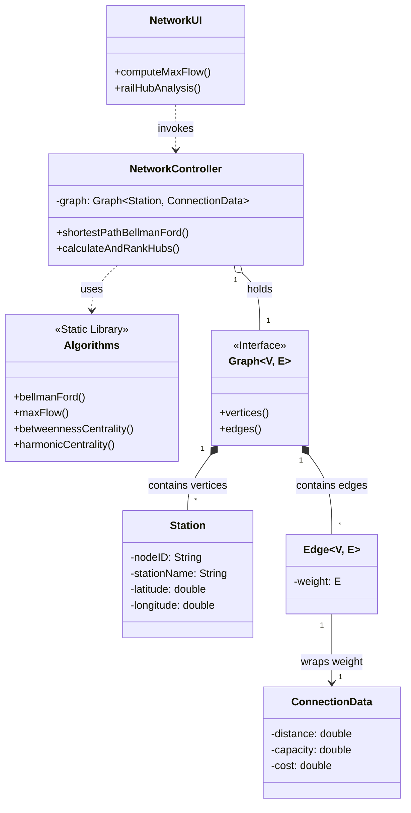

# Logistics On Rails - Advanced Routing & Network Analysis

**Academic Context:** 3rd Semester Integrative Project (BSc Software Engineering - ISEP). Developed in a team of 6 students.

***Note:** The source code is held in a private repository due to the institution's academic integrity policies. This repository documents the architecture, algorithms, and technical solutions developed.*

---

### The Business Problem
Development of a comprehensive platform to manage and optimize railway logistics and traffic operations. The system requires complex routing calculations, network capacity analysis, and hub identification, dealing with real-world constraints such as track capacities and negative edge costs (preferred links).

### Tech Stack
Java, JUnit 5, Graphviz (DOT format exports).

### Technical Solution & Architecture
The system was designed using a strict layered architecture to ensure separation of concerns: **UI Layer** (Console Interface), **Controller Layer**, **Domain Layer** (Entities and Services), and **Infrastructure/Library Layer** (Generic Graph implementations).

The core technical value of this module lies in the implementation of advanced graph algorithms from scratch to solve specific logistical problems:

*   **Risk-Aware Shortest Path:** Implemented the **Bellman-Ford** algorithm to calculate optimal routes supporting negative edge weights (bonuses) and detecting configuration errors via negative cycle detection.
*   **Maximum Throughput:** Utilized the **Ford-Fulkerson** algorithm (with DFS for augmentation paths) to determine the maximum flow capacity between two railway hubs.
*   **Minimal Backbone Network:** Applied **Prim's Algorithm** with a Priority Queue to compute the Minimum Spanning Tree (MST), minimizing total track length, and exporting the network geographically to Graphviz DOT format.
*   **Rail Hub Centrality:** Computed a composite `HubScore` by aggregating normalized graph metrics: *Betweenness Centrality* (shortest-path brokerage), *Harmonic Closeness* (accessibility), and *Vertex Strength* (direct connectivity).

### System Architecture

## Team
Developed in collaboration with Diogo Silva, Gonçalo Tavares, João Ferreira, Rodrigo Rocha and Rúben Martins.
